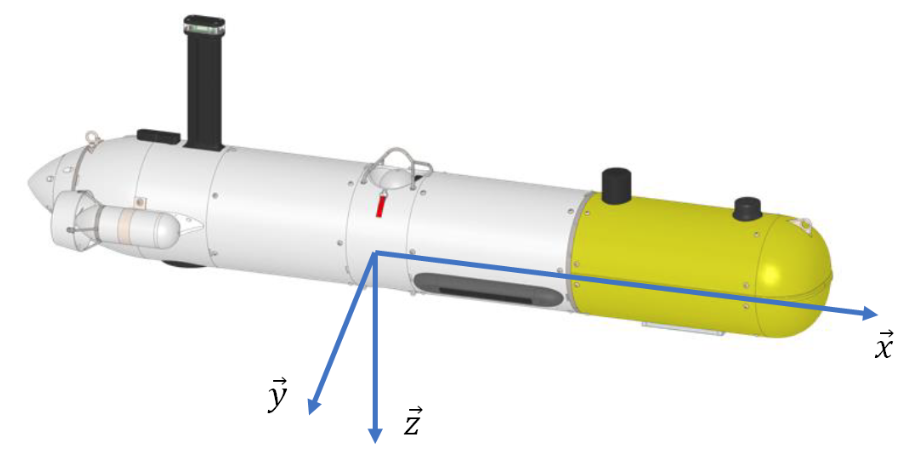
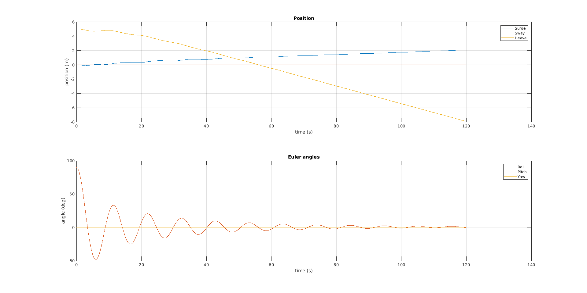
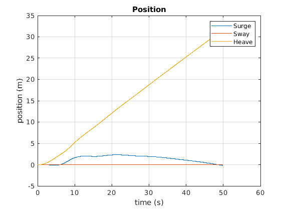
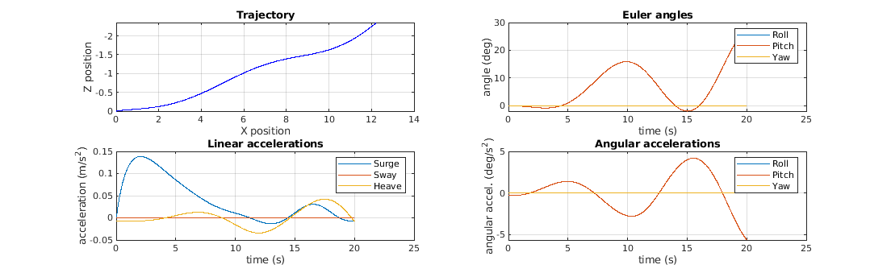
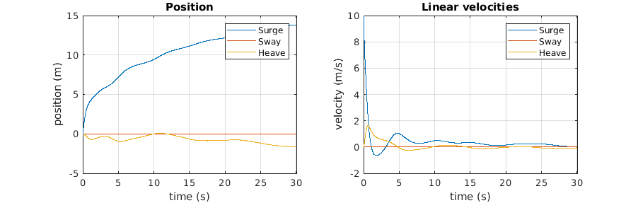
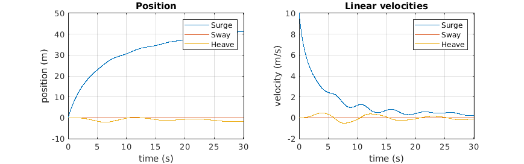
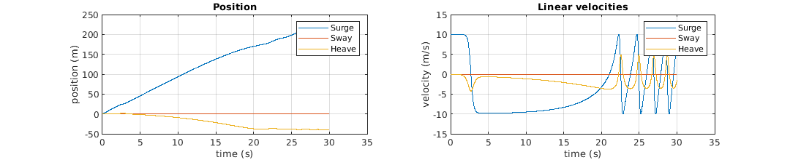

# Sparus AUV Modeling and Simulation

## Introduction
Sparus autonomous underwater vehicle, developed by IQUA Robotics in Girona, Spain, is used in a wide range of underwater operations. The project focus on the dynamic modeling and simulation of the Sparus vehicle by taking into consideration the stiffness, added mass, and damping effects. In addition, the dynamic model behavior in different underwater scenarios will be analyzed with the help of MATLAB & SIMULINK simulations.

The Sparus AUV is represented in the figure below. We consider the origin of the base "body" in the gravity center of the Sparus. It is placed at the x-position of the central thruster and at the middle of the cylinder.

Sparus AUV

## Project Workflow
1. **Compute Dimensions**  
   - Using the AUV picture and the known full-body length, computing all other dimensions of the different bodies.

2. **Analyze the Global Mass Matrix**  
   - Explaining all the terms in the global real mass matrix and identifying the origin of each term.

3. **Compute Added Mass Matrices**  
   - Compute each added mass matrix at the buoyancy center of the Sparus.
   - Except for the main body, the center of gravity (CG) and center of buoyancy (CB) of other bodies coincide.

4. **Compare Added Mass Matrices**  
   - Compare the matrix at CG and CO.
   - Discuss whether the distance between these two points is significant.

5. **Analyze Mass Contributions**  
   - Compare the values of the main solid with the other bodies and conclude.

6. **Compare Added and Real Mass Matrices**  
   - Identify differences and conclude on their significance.

7. **Estimate Drag Matrices**  
   - Compute all drag matrices.

8. **Validate the Simulator**  
   - Conduct simple experiments to verify the model accuracy.

9. **Simulate Mass Matrix Impact**  
   - Run simulations to highlight the effect of different coefficients in the global mass matrix by imposing linear accelerations.

10. **Simulate Drag Force Impact**  
   - Run simulations to observe the effect of drag forces on different bodies by imposing constant linear speed.

## Simulation Results and Experiments

After developing the mathematical model for the Sparus AUV, MATLAB and Simulink simulations were conducted. These simulations generate different motions for the Sparus using three thrusters: one aligned with the z-axis and two aligned with the x-axis. By running the simulations, we analyze the behavior and response of the Sparus to different underwater operational scenarios using output poses, velocities, and accelerations.

To simulate different scenarios, we vary the percentage of each thruster's maximum input force applied to the Sparus and adjust initial positions and velocities. 

### Buoyancy Behavior
To validate the simulator, we first test the buoyancy behavior by setting the thrusters activation to `[0 0 0]` and the initial positions to `[0 0 5 0 pi/2 0]`. In this scenario, the thrusters are deactivated, the initial z-position is +5, and the initial pitch orientation is 90 degrees. The following plot illustrates the buoyancy effect after running the simulation for 120 seconds:

    
    
Buoyancy Behavior

As seen in the figure, the Sparus starts to move upward from its initial z-position and adjusts its orientation from the initial 90-degree pitch angle to approximately 0 degrees due to hydrostatic equilibrium. This occurs because the center of buoyancy is above the center of gravity, creating a restoring moment that aligns the vehicle horizontally.

### Heave Motion
We test the heave motion along the z-axis by activating the thrusters `[100 0 0]` and setting initial positions and velocities to zero. The following plot illustrates the behavior after running the simulation for 50 seconds:

    
    
Heave Motion

As predicted, the Sparus moves downward in the positive z-direction, going deeper into the water.

### Mass Matrix Impact
The global mass matrix is given by:

\[ M_{\text{global}}^{CG}  = M_{\text{added}}^{CG} + M_{\text{real}}^{CG} \]

\[
M_{\text{global}}^{CG}  = 
\begin{bmatrix}
54.9889 & 0 & 0 & 0 & 0.0821 & 0 \\
0 & 111.0911 & 0 & -1.4338 & 0 & 2.6430 \\
0 & 0 & 144.3511 & 0 & -22.5864 & 0 \\
0 & -1.4338 & 0 & 1.6226 & 0 & -0.2161 \\
0.0821 & 0 & -22.5864 & 0 & 31.0733 & 0 \\
0 & 2.6430 & 0 & -0.2161 & 0 & 19.2672
\end{bmatrix}
\]

To analyze its effect, we impose linear acceleration along the x-axis by setting the thrusters to `[0 15 15]` and initial positions and velocities to zero. The following plots illustrate the results after running the simulation for 20 seconds:

    
    
Imposing Linear Acceleration Along X-Axis

### Drag Force Impact
To observe damping behavior, we impose a constant linear speed along the x-axis with initial speed set to 10. We compare simulations with and without antenna drag:

    
    
Simulation with All Drag Forces

    
    
Simulation Without Antenna Drag

Lastly, we test motion without drag forces:

    
    
Simulation Without Drag Forces

